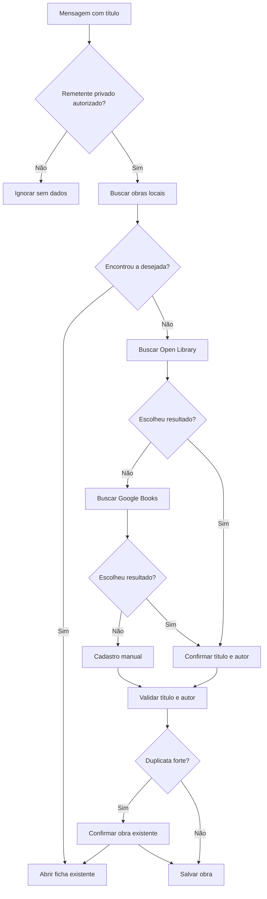
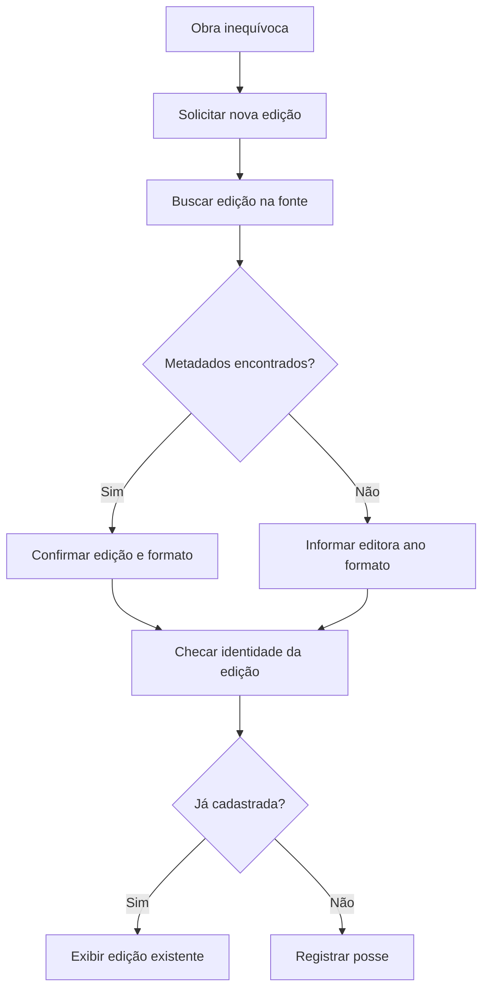
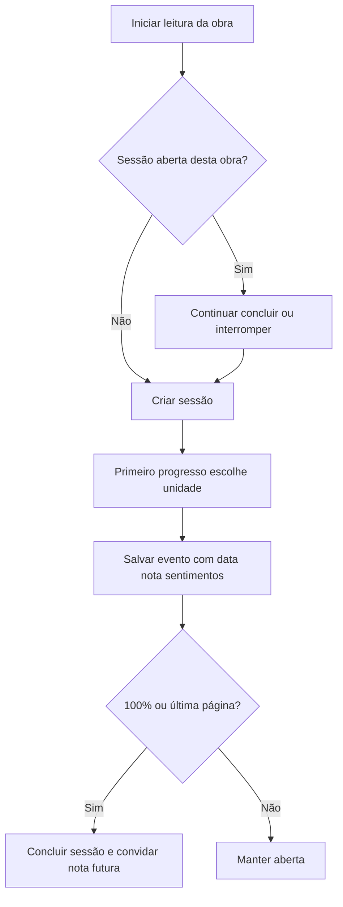
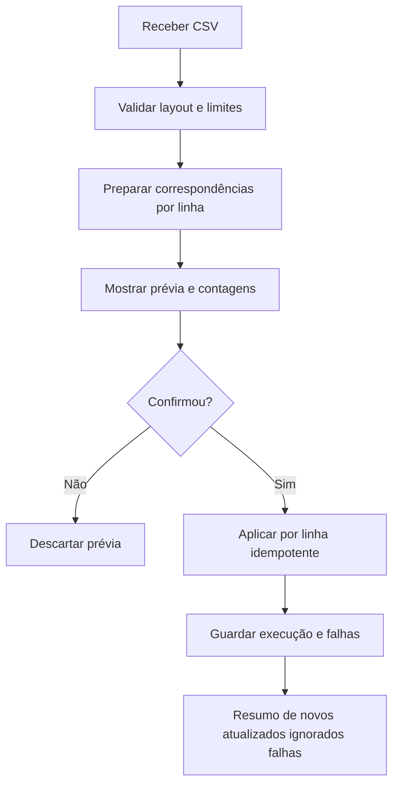
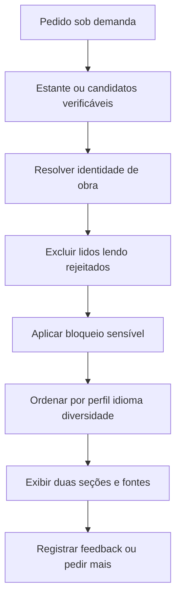

# Fluxos funcionais

Diagramas são especificação de comportamento; textos de mensagem são exemplos, não comandos obrigatórios.

## Busca e cadastro — MVP 1

Cada pesquisa retorna páginas de 3–4 opções textuais. A opção digitada se vincula ao snapshot da página e expira; antes da escrita o bot mostra exatamente título e autor. Se já existe, oferece abrir ou registrar edição possuída. A ação de cadastro sempre reconsulta chaves no banco antes de gravar, inclusive após confirmação.

## Edições possuídas — MVP 1

## Sessões e progresso — MVP 2

Se escolher continuar, não cria outra sessão. Páginas e porcentagem não se misturam na sessão. Marcar como lido sem progresso também conclui. Edição/exclusão de evento recalcula a condição de conclusão e solicita confirmação quando houver conflito.

## Importação incremental — MVP 3

Não criar data de leitura nem edição por inferência; estados e estantes manuais presentes têm prioridade. Cada falha conserva número da linha, código, motivo seguro e campos mínimos para revisão na Web 1.

## Recomendações — etapa 7

Conhecimento insuficiente sobre tema sensível rende aviso; representação explícita de tema bloqueado é excluída. Filtragem não altera estantes. Pedidos por autor/gênero/clima modificam ordenação e diversidade, sem remover regras de exclusão.
