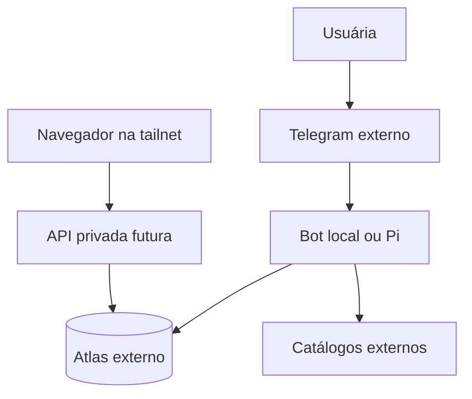

# Modelo de ameaças

## Fronteiras

**Ativos:** token Telegram, URI/credencial Atlas, ID autorizado, biblioteca, notas/sentimentos, dados de importação, perfil. **Entradas não confiáveis:** updates Telegram, CSV, metadados/descrições externos, tráfego web, output de IA futura.

| Ameaça | Caminho | Defesa e teste |
| --- | --- | --- |
| Spoofing | username ou grupo se passa pela usuária | validar `from.id`/chat privado/ID permitido antes do banco |
| Tampering | opção numerada antiga altera outra obra | snapshot versionado, TTL, confirmar título/autor e ID no commit |
| Repudiation | ação de importação falha sem evidência | `import_run` e erro por linha com ID/código sem texto sensível |
| Information disclosure | Web aberta pelo Funnel ou logs | tailnet ACL, teste externo, redaction, secrets fora de Git |
| DoS | CSV enorme/429/updates repetidos | limites bytes/linhas/página, timeout/backoff e idempotência |
| Elevation | operadores Mongo vindos de entrada | schemas fechados, construir filtros internamente, testes adversariais |
| Falsa segurança | IA/metadata omite tortura ou abuso | `unknown` com aviso e correção manual, nunca assegurar ausência |

**Risco residual:** Telegram e fornecedores de catálogo são serviços externos; um Pi único e conexão Atlas são pontos de falha; catálogo incompleto e classificação sensível incorreta são possíveis. Revisar após cada etapa.
