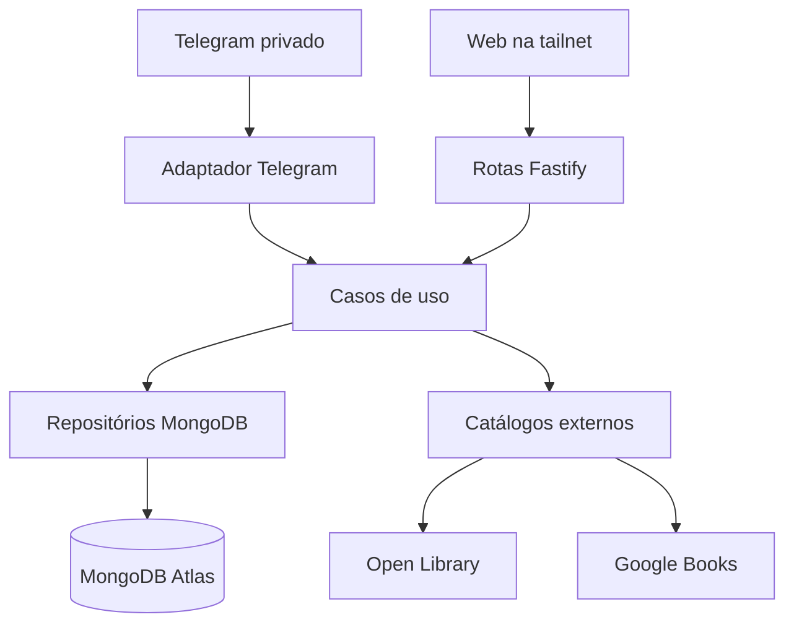

> Referência histórica do pacote inicial. A fonte vigente é [01-architecture/architecture-and-decisions.md](01-architecture/architecture-and-decisions.md).
> Para estado e configuração atuais, consulte o [README principal](../README.md).

# Arquitetura e registros de decisão

27/09/2026. Estado de todos os ADRs abaixo: **aceito** para iniciar, revisto quando a etapa indicada começar.

## Visão dos componentes



No MVP 1 só Telegram, casos de uso, catálogos e Atlas estão ativos. Fastify compõe aplicação e saúde local, sem rota pessoal pública. Separar `domain` (entidades/regras), `application` (casos de uso/portas), `infrastructure` (Mongo, HTTP, Telegram), `interfaces` (handlers e apresentação). Injeção por interfaces pequenas; o mesmo caso de uso atende Telegram e, futuramente, Web. Nenhum SDK externo entra no domínio. Conversa conserva contexto curto por `chatId`/`updateId` para paginação/confirmação, com expiração e operação idempotente; ações persistentes sempre revalidam IDs e estado.

## ADR-001 — Stack e execução

**Decisão:** Node.js/TypeScript, Fastify, MongoDB Atlas, Docker Compose, deploy manual; ambiente local no MVP 1. **Motivo:** ferramentas escolhidas pela usuária e crescimento incremental do bot à web. **Consequência:** sem servidor MongoDB no Compose; porta de saúde vinculada a localhost, sem API pública. Fixar versões de dependências e runtime no início do código, sem prometer números nesta especificação.

## ADR-002 — Obra, edição e posse

**Decisão:** identidade de obra (`works`) distinta de edição (`editions`); uma edição cadastrada é possuída. Obra pode não ter edição. Leitura e recomendação referenciam obra; sessão pode referenciar edição opcionalmente. **Motivo:** CSV sem ISBN/edição e vários exemplares de uma mesma obra. **Consequência:** ISBN/ID do provedor ajuda a identificar edição, jamais substitui resolução de obra. Uma identidade ambígua exige confirmação humana; colisão aproximada não causa fusão automática.

## ADR-003 — Transporte Telegram

**Decisão:** `getUpdates` por polling no MVP 1–3, uma instância consumidora; na etapa 4 `setWebhook` por NGINX/Funnel e desativação do polling. **Motivo:** execução local agora, Pi depois. **Consequência:** mesmo adaptador de mensagem e casos de uso, duas entradas intercambiáveis; armazenar `update_id` processado para deduplicar reentregas, confirmar offsets após processamento idempotente. Webhook valida cabeçalho secreto e usuário autorizado. Não usar polling e webhook simultaneamente.

## ADR-004 — Identidade local e consulta externa

**Decisão:** busca local antes de Open Library e Google Books; salvar somente após confirmação de título e autor e checagem de duplicata. **Motivo:** 845 livros iniciais, sem ISBN; poupar chamadas e evitar cadastro duplicado. **Consequência:** a identificação combina chaves de provedor, ISBN de edição, título/autor normalizados e revisão quando houver suspeita forte. Dados bibliográficos externos atualizam importados após escolha explícita, campos pessoais ficam preservados.

## ADR-005 — Estantes derivadas

**Decisão:** `Quero ler`, `Lendo`, `Lidos` são consultas derivadas de estados/sessões; `Favoritos`, `Detestados` e criadas pela usuária são associações persistentes. **Motivo:** evitar dessincronia após releitura ou exclusão de progresso. **Consequência:** uma obra pode aparecer em `Lendo` e `Lidos`; estantes manuais não somem por transição automática.

## ADR-006 — Acesso web

**Decisão:** Web e APIs pessoais apenas na tailnet, sem login dentro do aplicativo, conforme escolha da proprietária. Apenas `/telegram/webhook` publicado pelo Funnel. **Consequência:** segurança depende do acesso à tailnet e de segmentação/regras de ingress; autenticação via Telegram continua por `from.id`, `chat.type` e `chat.id`. Rever este ADR caso o aplicativo seja acessível fora da tailnet ou tenha outros usuários.

## ADR-007 — Recomendações verificáveis

**Decisão:** descoberta de candidatos por catálogo verificável, com fonte e identidade; exclusão de lidos/lendo e filtros sensíveis determinados por regras; IA opcional só para reordenação/explicação a partir de dados comprovados. **Consequência:** catalogação offline futura com dumps oficiais de Open Library, não varredura da API de busca; descrições incertas são rotuladas, e a ausência de metadados não cria certeza artificial.

## ADR-008 — Histórico e estados

**Decisão:** sessões e eventos próprios, com snapshots de dados de progresso; notas e sentimentos nos eventos. Estado de leitura de obra possui um sinal explícito de histórico/importação (`readEvidence`) além de sessões. **Motivo:** 764 livros importados como lidos sem data e exclusões posteriores de sessão não devem inventar nem apagar evidência silenciosamente. **Consequência:** regras de recomputação solicitam decisão quando a única evidência de leitura concluída é removida.

## Estrutura inicial sugerida

```text
src/
  domain/          # obra, edição, regras puras, normalização
  application/     # busca, cadastro, importação, interfaces de portas
  infrastructure/  # MongoDB, Open Library, Google Books, Telegram
  interfaces/      # tradução de mensagens, apresentação, saúde Fastify
  bootstrap/       # configuração validada e composição
scripts/            # importação inicial e verificações operacionais
tests/              # casos de uso e integrações importantes
```

**Fontes oficiais:** [Fastify validation](https://fastify.dev/docs/latest/Reference/Validation-and-Serialization/), [MongoDB unique indexes](https://www.mongodb.com/docs/manual/core/index-unique/), [Telegram Bot API](https://core.telegram.org/bots/api), [Docker Compose secrets](https://docs.docker.com/compose/how-tos/use-secrets/), [Tailscale Funnel](https://tailscale.com/kb/1223/funnel).
