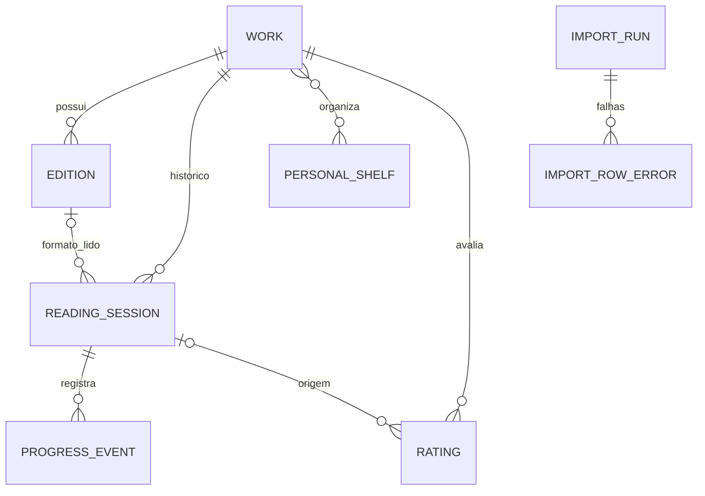

> Referência histórica do pacote inicial. A fonte vigente é [03-data/data-model.md](03-data/data-model.md).
> Para estado e configuração atuais, consulte o [README principal](../README.md).

# Modelo de dados — MongoDB Atlas

Modelo lógico, com exemplos de campos e índices; escolher nomes definitivos ao codificar. IDs internos UUID ou ObjectId estáveis. Datas ISO UTC e fuso de exibição separado. Campos desconhecidos são ausentes, não preenchidos artificialmente.

| Coleção | Campos essenciais | Etapa |
| --- | --- | --- |
| `works` | `_id`, `title`, `authors[]`, `normalizedTitle`, `normalizedAuthors[]`, `externalIds` (Open Library work key etc.), `bibliographic` (gênero, editora se pertinente, anos, idiomas, descrição, cover refs), `fieldSources`, `rawTags[]`, `readEvidence` (`importedRead`, `manualRead`, etc.), `bookNotes?`, `createdAt`, `updatedAt` | 1; notas na Web 2 |
| `editions` | `_id`, `workId`, `title?`, `authors?`, `isbn10?`, `isbn13?`, `externalIds`, `publisher?`, `publicationYear?`, `format?`, `pageCount?`, `language?`, `owned: true`, `fieldSources`, timestamps | 1 |
| `telegram_sessions` | `chatId`, `userId`, `pendingIntent`, `resultSnapshot[]`, `page`, `expiresAt`, `version` | 1 |
| `processed_updates` | `updateId`, `processedAt`, `outcome`; TTL operacional conforme política | 1 |
| `reading_sessions` | `_id`, `workId`, `editionId?`, `status` (`open`, `completed`, `interrupted`), `startedAt`, `endedAt?`, `unit?` (`pages`, `percent`), `totalPages?`, `completionMethod?`, timestamps | 2 |
| `progress_events` | `_id`, `sessionId`, `occurredAt`, `value?`, `unit?`, `totalPagesSnapshot?`, `note?`, `feelingIds[]`, `createdAt`, `updatedAt` | 2 |
| `feelings` | `_id`, `label`, `emoji?`, `normalizedLabel`, `kind` (`preset`, `custom`) | 2 |
| `personal_shelves` | `_id`, `name`, `normalizedName`, `kind` (`favorite`, `detested`, `custom`), timestamps | 3 |
| `shelf_memberships` | `workId`, `shelfId`, `createdAt`; `source` manual/imported where applicable | 3 |
| `import_runs` | `_id`, `source`, `filename`, `fileHash`, `status`, counts, `startedAt`, `finishedAt?`, `schemaVersion` | 1 initial; 3 bot |
| `import_row_errors` | `runId`, `rowNumber`, `code`, `reason`, `safeRowExcerpt`, `resolvedAt?`, `resolution?` | 1 initial; 3 bot |
| `ratings` | `_id`, `workId`, `readingSessionId?`, `value` integer 2..10 (meias estrelas), `review?` apenas por sessão, timestamps | Web 2 |
| `profile_preferences` | `dimension` (author/genre/theme), `valueKey`, `weight` 0..10, `source` manual/inferred, evidência/versão, timestamps | Web 2 |
| `recommendation_feedback` | `workId` ou identidade externa canônica, `action` (rejected/read/saved), `at`, contexto | 7 |
| `sensitive_assessments` | `workId` ou candidato externo, `theme`, `classification` (explicit/contextual/unknown/absent), `sourceUrl?`, `origin` (manual/external/automated), `confidence?`, timestamps | 7 |

`bibliographic` é metadado da obra, com exceções específicas de edição em `editions`. Preservar a observação original do CSV e proveniência por campo, inclusive quando uma atualização de fonte externa substitui a bibliografia. O CSV inicial não cria `reading_sessions`, `editions` ou datas lidas. `readEvidence` distingue livro importado como lido de sessão concluída. A estante automática é projetada a partir dessa evidência e sessões abertas, não armazenada em `shelf_memberships`.

## Identidades e índices

- `works.externalIds.openLibraryWorkKey` e outras chaves de **obra**: índices únicos parciais onde presentes.
- `editions`: índices únicos parciais por ISBN13/ISBN10 normalizado e IDs de edição, com revisão quando o mesmo identificador de edição aponta a obras distintas; a unicidade pode ser composta por coleção e catálogo de origem. **Não** criar índice único indiscriminado em ISBN de obra.
- `works(normalizedTitle, normalizedAuthors)` índice para candidatos; não único, pois tradução, homônimos e variações existem. Comparação forte produz sugestão e confirmação, não fusão automática.
- `editions(workId, publisherNormalized, publicationYear, formatNormalized)` índice de candidatos, não necessariamente único: editoras/ano/formato podem representar tiragens distintas.
- `reading_sessions(workId, status)` índice único parcial quando `status=open`, impondo no máximo uma sessão aberta por obra; vários `workId` diferentes podem coexistir.
- `progress_events(sessionId, occurredAt, _id)` para histórico estável; `shelf_memberships(shelfId, workId)` único; `personal_shelves.normalizedName` único; `processed_updates.updateId` único e TTL; `import_row_errors(runId, rowNumber)` para auditoria.
- Cada escrita que cria obra/edição verifica novamente candidatos imediatamente antes da inserção e trata violação de índice como recuperação de concorrência: lê existente e apresenta a escolha, sem gravação duplicada.

## Regras de consistência

1. Resolver ID de obra antes de qualquer atualização. Não inferir posse de ISBN encontrado no catálogo.
2. Campos pessoais (estado, estantes, notas, sentimentos, ratings, preferências) nunca são sobrescritos por fonte bibliográfica.
3. Ao excluir progresso ou sessão, recalcular status e perguntar quando a evidência de conclusão/estado resultante se tornar ambígua.
4. Em releitura, `Lidos` pode coexistir com `Lendo`; `Quero ler` só se não houver leitura comprovada nem sessão aberta.
5. Nota geral = média aritmética de **todas** as avaliações registradas para obra, incluindo avaliação direta de importado; armazenar soma/quantidade ou computar a partir de `ratings`, preservar média exata, arredondar só na apresentação a 0,5.
6. Mudança de título/autor de fonte conserva aliases/histórico normalizados para reencontrar CSV e evitar obra duplicada.
7. Exclusão de estante pessoal remove somente associação e estante; qualquer exclusão definitiva de leitura/evento exige confirmação identificada.

## Evolução

Adicionar campos e coleções por etapa, com `schemaVersion`, migrações pequenas e repetíveis, backup antes de migração destrutiva. Índices devem ser criados explicitamente no bootstrap/migração. Testar migração com base inicial de 845 obras e casos de colisão, sem depender de transações em tudo; usar operação atômica ou transação quando múltiplas coleções tiverem de mudar conjuntamente.

**Referência:** [MongoDB indexes](https://www.mongodb.com/docs/manual/indexes/), [unique indexes](https://www.mongodb.com/docs/manual/core/index-unique/), [transactions](https://www.mongodb.com/docs/manual/core/transactions/).
