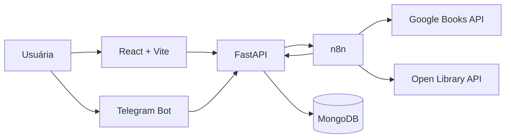

# Arquitetura — visão geral

## Objetivos arquiteturais

- separar regras de negócio de frameworks e provedores externos;
- permitir substituição de integrações sem alterar o domínio;
- manter MongoDB como fonte de verdade;
- usar automações apenas como orquestração;
- garantir testabilidade, observabilidade e segurança desde o início.

## Containers



## Responsabilidades

### FastAPI

- expor contratos HTTP;
- executar casos de uso;
- validar regras de domínio;
- controlar deduplicação;
- persistir dados;
- autorizar callbacks internos;
- manter o estado das operações.

### MongoDB

- armazenar livros, progresso, avaliações e histórico operacional;
- garantir unicidade de ISBN por índice;
- suportar soft delete e consultas paginadas.

### n8n

- consultar provedores externos;
- aplicar timeout, retry e fallback;
- executar rotinas agendadas;
- enviar notificações;
- chamar endpoints internos da API.

O n8n não contém regras centrais do domínio e não acessa o MongoDB diretamente.

### Telegram e frontend

São adaptadores de entrada. Ambos consomem a mesma API e não acessam persistência diretamente.

## Camadas do backend

```text
backend/src/codexathenae/
├── domain/
│   ├── entities/
│   ├── value_objects/
│   ├── enums/
│   └── exceptions/
├── application/
│   ├── use_cases/
│   ├── dto/
│   └── ports/
├── infrastructure/
│   ├── persistence/mongodb/
│   ├── external/
│   ├── settings/
│   └── observability/
├── presentation/
│   ├── api/
│   └── telegram/
└── main.py
```

## Dependências permitidas

```text
presentation  ─┐
               ├──> application ───> domain
infrastructure ┘
```

- `domain` não importa nenhuma outra camada;
- `application` depende apenas de `domain` e de suas próprias portas;
- `infrastructure` implementa portas;
- `presentation` converte protocolos externos em entradas de casos de uso.

## Segurança inicial

- segredos somente por variáveis de ambiente ou secret store;
- webhooks internos autenticados;
- validação e limite de payload;
- princípio do menor privilégio;
- logs sem tokens ou dados sensíveis;
- confirmação humana antes de persistir metadados externos;
- dependências e imagens verificadas no CI.

## Observabilidade inicial

- logs estruturados com correlation ID;
- latência e status dos endpoints;
- tempo e resultado de chamadas externas;
- quantidade de retries e respostas 429;
- falhas de callback e reprocessamento;
- health checks de liveness e readiness.
